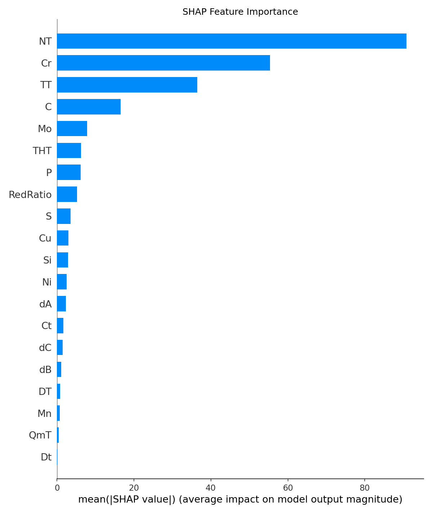
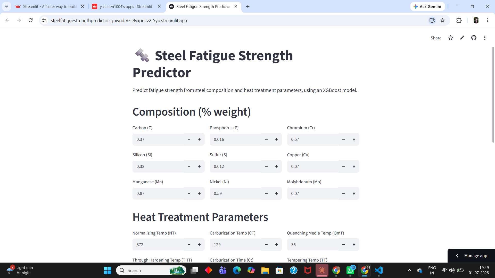
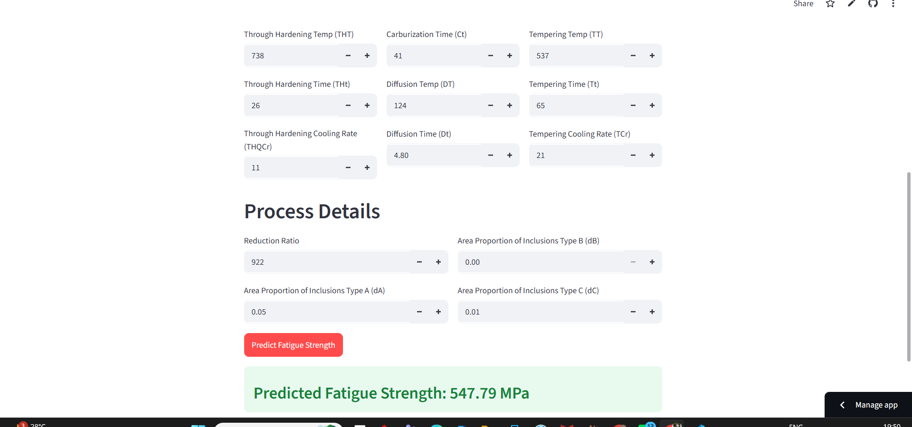

# 🔩 Steel Fatigue Strength Predictor

An end-to-end regression project predicting the fatigue strength of steel from chemical composition and heat treatment parameters, using XGBoost with SHAP-based interpretability. Deployed as an interactive Streamlit app.

**🔗 Live App:** https://steelfatiguestrengthpredictor-ghwndrv3c4yxpeltz2t5yp.streamlit.app

---

## 📌 Overview

Fatigue testing of steel is slow and expensive — samples have to be physically cycled to failure to measure how much stress they can withstand over repeated loading. This project explores whether fatigue strength can be reliably estimated from readily available data instead: chemical composition (C, Si, Mn, Cr, Ni, Cu, Mo, etc.) and heat treatment process parameters (normalizing temperature, tempering temperature/time, quenching parameters, reduction ratio, and more).

The idea for this project grew out of hands-on materials characterization work during my internship at IIT BHU, which got me interested in how composition and processing decisions translate into measurable mechanical properties — and whether that relationship could be captured by a data-driven model.

## 🎯 Problem Statement

- **Task:** Predict `Fatigue Strength (MPa)` from 25 numeric features (9 composition variables, 16 heat treatment/process variables)
- **Type:** Regression
- **Dataset size:** 437 samples, fully numeric, no missing values

## 🧪 Approach

### 1. Exploratory Data Analysis
- Checked target distribution (right-skewed) and confirmed high-fatigue outliers were tied to genuinely higher-alloy compositions, not data errors — so they were retained rather than removed
- Correlation analysis between composition/process variables and fatigue strength
- Checked for multicollinearity among paired process variables (e.g., temperature/time pairs)

### 2. Modeling
Given the small dataset size, the data was split once into train (80%) and test (20%) sets. All model selection and hyperparameter tuning was done using **5-fold cross-validation on the training set only**; the test set was held out and evaluated exactly once at the end, to get an honest, leakage-free estimate of generalization.

Three models were trained and compared:

| Model | R² (Test) | RMSE | MAE |
|---|---|---|---|
| Linear Regression | 0.97 | 32.16 | 24.87 |
| Random Forest | 0.99 | 24.45 | 19.00 |
| **XGBoost (final)** | **0.99** | **21.41** | **15.58** |

XGBoost was selected as the final model. Train R² (0.998) vs. test R² (0.989) showed only a small gap, indicating the model generalizes well rather than overfitting to the training data.

### 3. Interpretability (SHAP)
SHAP (SHapley Additive exPlanations) was used to move beyond "which features matter" to understanding *how* each feature drives predictions.



**Key findings:**
- **Normalizing Temperature (NT)** was the single strongest driver of predicted fatigue strength, with a threshold-like effect — mattering most at higher values rather than scaling linearly across its full range
- **Chromium (Cr)** showed the cleanest, most interpretable pattern: higher Cr content consistently increased predicted fatigue strength, consistent with its established role in solid-solution strengthening and hardenability
- **Tempering Temperature (TT)** had a more complex, non-monotonic effect — plausible given that over-tempering is known to reduce strength in real heat treatment practice
- **Carbon (C)** showed a moderate, secondary influence, consistent with its known role in hardenability
- Fine composition elements (Mo, Si, Ni, Cu) had comparatively minor influence — heat treatment parameters appear to play a larger role than fine-grained composition tuning for this dataset

### 4. Deployment
The final model was deployed as an interactive Streamlit app, allowing users to input composition and heat treatment parameters and get a real-time fatigue strength prediction.

**Dashboard preview:**





## 🛠️ Tech Stack
- **Language:** Python
- **Modeling:** XGBoost, scikit-learn (Linear Regression, Random Forest)
- **Tuning:** RandomizedSearchCV with 5-fold cross-validation
- **Interpretability:** SHAP
- **Deployment:** Streamlit Community Cloud
- **Data handling:** pandas, NumPy

## 📁 Repository Structure
```
├── notebook/
│   └── fatigue.ipynb         # Full analysis notebook (EDA, modeling, SHAP)
├── app.py                    # Streamlit application
├── fatigue_model.pkl         # Trained XGBoost model
├── data.csv                  # Training dataset
├── shap_bar_importance.png   # SHAP feature importance plot
├── requirements.txt          # Python dependencies
└── README.md
```

## 🚀 Running Locally

```bash
git clone https://github.com/Yashasvi1004/steel_fatigue_strength_predictor.git
cd steel_fatigue_strength_predictor
pip install -r requirements.txt
streamlit run app.py
```


## 👤 Author
**Yashasvi Dewangan**
[GitHub](https://github.com/Yashasvi1004)
